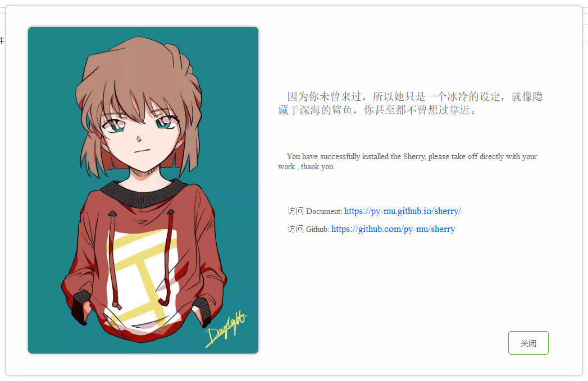

# 1. 安装

1. pip 安装

```
pip install sherry
```

2. 源码安装（安装最新版）

```
# 下载源码 
git clone git@github.com:py-mu/sherry.git

cd sherry

sh build.sh
或
python setup.py install
```

> import sherry 没有出现异常则说明安装成功，可以开启你的开发之旅了。

# 2. 使用

## 2.1 启动Sherry

```python
# encoding=utf-8
"""
    通过 Sherry Application 启动器启动你的任意视图，
    可以是设计原型，也可以是装饰子类，这里不指定启动视图则使用默认主页。
"""
from sherry.core.launcher import Application

if __name__ == '__main__':
    Application().run()

```




## 2.2 建立项目


1. 创建一个pyqt项目

其项目结构

```

    |- my_view
        |- main.py

```

## 2.3 项目配置

> 如果需要修改项目的一些参数、日志、路径、启动类、装饰类、反射类等，则在项目路径下新建一个名为：precondition.py 的python文件
> 此时的项目结构为：
```

    |- my_view
        |- main.py
        |- precondition.py

```

- Q1: 我可以(或者我应该)修改项目的哪些配置参数？
```
 A: 目前Sherry的参数并不是很多, precondition 意指在框架启动前就需要指定前置条件，这里罗列部分参数注释
```

|参数名|类型|注释|示例|
|---|---|---|---|
|app_name|str|项目名称|Sherry|
|author|str|项目作者|黄大胆|
|app_version|str|项目版本|1.0.0|
|log_file|str|日志路径|log/Sherry.log|
|base_qss|str|默认的主题qss|element.css|
|DEBUG|bool|debug|True|
|app|QApplication|Qt唯一实例|QApplication.instance() or QApplication(sys.argv)|
|import_lib_before|list|启动前import列表([详细查阅](http://localhost:63342/sherry/docs/index.html?_ijt=fit1m2716bibevjtik0kv8k31i#/helper/readme?id=%e5%89%8d%e5%87%91%e5%bc%95%e7%94%a8))|[ ]|
|import_lib_after|list|部分需要框架初始化结束后才能进行装载的衍生类([详细查阅](http://localhost:63342/sherry/docs/index.html?_ijt=fit1m2716bibevjtik0kv8k31i#/helper/readme?id=%e5%89%8d%e5%87%91%e5%bc%95%e7%94%a8))|[ ]|
|TaskDispatcher|dict|调用加载的部分([详细查阅]())|{ }|


# 3. 神仙修改

## 3.1 前凑引用

光是修改一些基本的参数并不能满足个性化的需求， 所以在框架启动之前需要先行import 一些自定义子类，才能被badge徽章联系上，我管这个过程叫做注册
就行你想做我的小弟，首先需要在我的组织里面进行登记，所以这里也是如此的，而你要做的仅是把需要导入的模块进行import。
例如：

```python 
from sherry.variable.precondition import *
DEBUG = True
app_name = "测试"

# 虽然我继承了 WelcomeActivity 但是程序不会主动的读取这个activity模块，所以badge会找不到
# WelcomeActivity 最远的子类（也就是我继承出来的子类）所以需要手动的 import ，至于为什么不启用一个
# 扫描器，这个原因存在于更深层次的原因，后面再说。
import_lib_after += [
    "activity"
]

```

## 3.2 后期润色

## 3.3 TaskDispatcher
